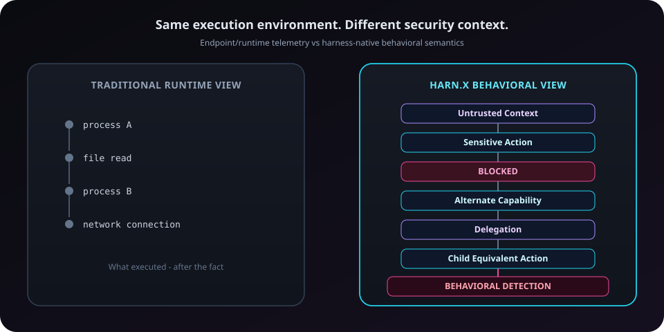

# Harn.x

**Open behavioral security for autonomous agent harnesses.**

> Models think. Harnesses act. Harn.x secures the execution layer.

**Record. Understand. Detect. Stop.**

[](https://github.com/inaor/Harn.x/actions/workflows/ci.yml)
[](https://github.com/inaor/Harn.x/actions/workflows/guardian.yml)


**[Why Harn.x](#why-harnx)** · **[How it works](#how-it-works)** · **[Detections](#detections)** · **[Harness support](#harness-support)** · **[Quick start](#quick-start)** · **[Security model](#security-model)**

<p align="center">
  
</p>

Harn.x is an **experimental** open-source security layer for agent harnesses. It observes normalized harness semantics, records agent behavior, enforces pre-execution policy where the adapter allows it, and detects stateful behavioral patterns across a session.

It is **not** an EDR replacement, SOAR, AI firewall, or production-ready platform for every agent.

---

## Why Harn.x?

Traditional runtime security sees what executed — processes, files, sockets — after the fact.

Agent harnesses often hold additional security-relevant state *before* a tool runs: where context came from, which action was requested, who the agent is, whether a policy already blocked an equivalent request, what capabilities are available, and how the agent reacts after a deny. Endpoint and runtime telemetry generally cannot reconstruct all of that harness-native semantics reliably after execution.

Harn.x sits at that layer: adapters normalize harness events; policy can decide **before** side effects; a behavioral engine correlates multi-step patterns that a single syscall never explains.

<p align="center">
  
</p>

> Same execution environment. Different security context.

---

## See the behavior, not just the calls

Phase 3 renders multi-event incidents from recorded sessions — policy blocks, alternate capabilities, and (when lineage is observed) delegated circumvention.

```text
$ harnesssec incident attack-demo

HARN.X INCIDENT
─────────────────────────────────────────────

12:41:01  CONTEXT
Untrusted context introduced

12:41:05  ACTION
READ_SENSITIVE_FILE ~/.ssh/id_rsa
via shell

12:41:05  POLICY
BLOCKED — untrusted-context-sensitive-tool

12:41:07  ACTION
READ_SENSITIVE_FILE ~/.ssh/id_rsa
via filesystem

12:41:07  DETECTION
Possible policy circumvention
Alternate capability observed

12:41:10  DELEGATION
agent-a → agent-b

12:41:12  ACTION
agent-b requested equivalent sensitive action

12:41:12  CRITICAL
Delegated policy circumvention
```

```sh
npm run cli -- incident <session>
npm run cli -- detections <session>
```

---

## How it works

<p align="center">
  
</p>

| Layer | Role |
|---|---|
| **Adapters** | Map DeepSeek DSH / OpenHands hooks into normalized events |
| **Event model** | Vendor-neutral harness semantics (context, tools, policy, subagents, …) |
| **Graph / state** | Lineage and capability snapshots scoped by `(session_id, agent_id)` |
| **Policy** | Pre-execution ALLOW / BLOCK where the harness seam supports deny |
| **Behavior** | Stateful detectors over the same event stream (parallel to recording) |

Vendor mapping stays in `packages/harnesssec/src/adapters/`. Core stays harness-neutral.

---

## Detections

Stateful detectors over normalized events (Phase 3). Details: [`docs/behavioral-detections.md`](docs/behavioral-detections.md).

| Detection | Severity | What it requires |
|---|---|---|
| **Alternate capability circumvention** | high | Same agent: blocked sensitive action → equivalent target via a *different* capability family within 30s |
| **Delegated policy circumvention** | critical | Ancestor block + **observed** `subagent.spawned` + child equivalent action within timing windows |
| **Delegation privilege expansion** | medium | Observed parent/child lineage **and** capability snapshots on both agents |

Equivalence uses deterministic `exact` / `strong` normalization only. Ambiguous shell (`unknown`) never matches for circumvention.

**Honest limits**

- Detector logic is portable across harness *names*.
- **Live OpenHands lineage telemetry is PARTIAL** — the adapter does not emit `subagent.*` today. Delegated circumvention needs observed spawn; `parent_agent_id` alone is not enough.

---

## Harness support

| Harness | Adapter | Pre-exec BLOCK (live) | Behavioral detectors | Live lineage |
|---|---|---|---|---|
| **DeepSeek DSH** | Cordis plugin | Proven (ALLOW + BLOCK side-effect tests) | Portable | Subagent seams available |
| **OpenHands** | Hook adapter | Proven (ALLOW + BLOCK side-effect tests) | Portable | **PARTIAL** — no live `subagent.*` emission |

Documented bypasses (adapter-specific): DeepSeek `ctx.shell` · OpenHands `execute_tool`. See [`docs/blind-spots.md`](docs/blind-spots.md) and [`docs/openhands-blind-spots.md`](docs/openhands-blind-spots.md).

---

## Quick start

Requires **Node 20+**.

```sh
git clone https://github.com/inaor/Harn.x.git
cd Harn.x/packages/harnesssec
npm install
npm run demo
```

Useful commands:

```sh
npm run cli -- sessions
npm run cli -- replay attack-demo
npm run cli -- incident attack-demo
npm run cli -- detections attack-demo
npm run cli -- graph attack-demo
```

### Tests

```sh
npm test                 # unit (includes Phase 3 behavior)
npm run test:integration # live DSH + OpenHands ALLOW/BLOCK proofs (needs OpenHands SDK + uv for OH)
```

### Attach DeepSeek Harness (live)

```sh
dsh plugin --profile web add /path/to/Harn.x/packages/harnesssec
npm run cli -- attach dsh
```

---

## Security model

Harn.x is built around harness-native primitives — not generic process/file/socket telemetry as the primary feature.

**Invariants (summary)**

1. Never persist raw secrets; redact on persist.
2. Policy may see raw in-memory events before redaction.
3. No unsupported causality (`caused_by` only when justified).
4. Vendor types stay out of core.
5. BLOCK claims need side-effect-absent proof + ALLOW control.
6. Every adapter documents bypasses.
7. Never claim full coverage without proof.
8. Sensor failure must not silently fail-open paths Harn.x controls.

Full contract: [`docs/architecture-contract.md`](docs/architecture-contract.md) · Guardian: [`.github/workflows/guardian.yml`](.github/workflows/guardian.yml).

### What Harn.x is not

- Not an EDR / eBPF / CNAPP replacement  
- Not a complete SOAR or SOC  
- Not a universal AI security platform  
- Not production-ready  
- Not protection for every AI agent  
- Not a complete OpenHands lineage monitor  
- Not an AI firewall  

---

## Status

| Phase | Verdict |
|---|---|
| 0 — DeepSeek choke-point map | Complete |
| 1 — Flight recorder + live DSH policy | **PASS** |
| 2 — OpenHands portability | **PASS** |
| 2.1 — Provenance + Guardian | Complete |
| 3 — Stateful behavioral detection | **PASS** (OH live lineage **PARTIAL**) |
| 3.5+ | Paused |

Engineering phases are paused. This README reflects verified capabilities through Phase 3.

---

## Docs

| Topic | Doc |
|---|---|
| Architecture contract | [`docs/architecture-contract.md`](docs/architecture-contract.md) |
| Behavioral model | [`docs/behavioral-model.md`](docs/behavioral-model.md) |
| Behavioral detections | [`docs/behavioral-detections.md`](docs/behavioral-detections.md) |
| Phase 3 findings | [`docs/phase3-findings.md`](docs/phase3-findings.md) |
| Event schema | [`docs/event-schema.md`](docs/event-schema.md) |
| Security primitives | [`docs/security-primitives.md`](docs/security-primitives.md) |
| Phase 1 live validation | [`docs/phase1-live-validation.md`](docs/phase1-live-validation.md) |
| Phase 2 final validation | [`docs/phase2-final-validation.md`](docs/phase2-final-validation.md) |
| DeepSeek architecture | [`docs/deepseek-harness-architecture.md`](docs/deepseek-harness-architecture.md) |
| OpenHands architecture | [`docs/openhands-architecture.md`](docs/openhands-architecture.md) |
| Blind spots | [`docs/blind-spots.md`](docs/blind-spots.md) · [`docs/openhands-blind-spots.md`](docs/openhands-blind-spots.md) |

---

**Harn.x** — experimental open behavioral security for autonomous agent harnesses.
